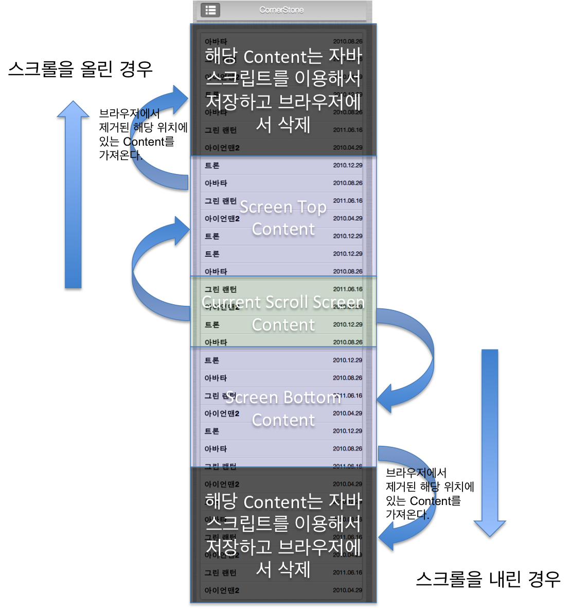

<!--
{
	"id": 4402,
	"title": "리스트뷰(ListView)",
	"outline": "Cornerstone의 리스트뷰는 일반적으로 엘리먼트를 추가하고 삭제하는 방식외에도 리스트의 DOM구조가 복잡한 경우에도 부드럽게 동작하도록 최적화 옵션을 제공한다. javascript를 이용하는 방식...",
	"tags": ["widget", "featured"],
	"order": [4, 4, 2],
	"thumbnail": "4.4.02.listview.png"
}
-->


# 리스트뷰(ListView)

Cornerstone 리스트뷰는 일반적으로 엘리먼트를 추가하고 삭제하는 방식외에도 리스트의 DOM구조가 복잡한 경우에도 부드럽게 동작하도록 최적화 옵션을 제공한다.

Cornerstone 리스트뷰의 최적화 알고리즘은 다음과 같다.



## 설치하기

패키지 매니저를 이용해 필요한 라이브러리를 모두 다운로드 받고 사용자가 사용하는 방식에 따라 필요한 라이브러리를 사용하면 된다.

```
jam install widget-listview
```

## 의존성

종류 | 버전 | Plugin | Backbone View
:-- | :-- | :--: | :--: | :--:
underscore | 1.4.4 | X | O
backbone | 1.0.0 | X | O
jquery | 1.10.2 | O | O
infinity | 1.0.0 | O | O

> AMD 방식으로 개발하는 경우 `"widget-listview"`만 define에 선언하면 의존성이 걸린 라이브러리를 자동적으로 가져온다.

## 사용법

종류 | 사용방법 | 설명
:-- | :-- | :--
Plugin | `$("#example").featuredListView()` | 위젯을 jQuery Plugin 방식으로 적용
Backbone View | 아래 `Snippet` 참고 | 위젯을 Backbone View 방식으로 적용

## 기능
기능을 사용하기 전에 엘리먼트에 해당 플러그인을 적용시킨 후에 가능하다.
```
$("#example").featuredListView("addItem", html);
```
메소드명 | 설명
:-- | :--
addItem | 목록을 추가할 때 사용
removeItem | 목록을 삭제할 때 사용

> 매개변수인 html은 추가나 삭제를 하려는 엘리먼트를 넣어줘야 한다.

## 옵션

설정 | 타입 | 기본값 | 설명
:-- | :-: | :-: | :--
optimization | boolean | true | 리스트뷰에 최적화 활성 여부 옵션
SCROLL_THROTTLE | number | 0 | 최적화가 활성화될 때 사용하는 옵션으로 화면에 보여지지 않는 컨텐츠를 스크롤 이벤트를 통해 얼마나 빨리 보여질지 감출지 속도를 제어한다.
scrollEndAction | function | null | 브라우저의 스크롤이 마지막인 경우 옵션에 정의한 함수를 실행시킨다. Endless를 구현할 때 사용된다.

## 이벤트
종류 | 설명
:-- | :-- |:--
`scrollEnd.cs.listView` | 브라우저의 스크롤이 마지막인 경우 이벤트 발생

## Snippet
### Sample Data
```
[
    {
        "_id": 1,
        "title": "아바타",
        "published": "2010.08.26"
    },
    {
        "_id": 2,
        "title": "그린 랜턴",
        "published": "2011.06.16"
    }
    ...
]
```
> Ajax 요청시 응답으로 넘어오는 JSON 포맷이 위 샘플과 다른 경우 사용자가 직접 jQuery Plugin인 경우
 ajax의 success 또는 request의 done 함수에서 파싱하는 코드를 작성해야하며, Backbone View를 사용하는 경우
 collection를 정의할 때 parse 부분을 수정해야 한다.


### jQuery Plugin
#### HTML
```
<div id="example" class="list-view list-group"></div>
```

#### JS
```
$("#example").featuredListView();
```

### Backbone View
#### HTML
위와 동일(jQuery Plugin HTML)

#### JS
```
define(["widget-listview"], function(ListView) {
    // 콜렉션에 데이터를 가져올 url를 설정한다.
    var ItemList = Backbone.Collection.extend({
        url: "data/sample-list.json",

        // 기본 id 속성은 id이다. id 명칭을 _id로 변경하고 싶을 때 설정
        model: Backbone.Model.extend({
            idAttribute: "_id"
        })
    });

    var itemList = new ItemList();

    // 아이템뷰를 만든다.
    var html = '{{_id}}. {{this.title}}';
    html += '<div class="pull-right">';
    html += '   <span class="badge">{{this.published}}</span>';
    html += '   <span class="glyphicon glyphicon-chevron-right"></span>';
    html += '</div>';

    // 리스트 아이템 뷰 정의
    var ItemView = Backbone.View.extend({
      tagName: "a",
      className: "list-group-item",
      template: Handlebars.compile(html),
      render: function () {
        this.$el.html(this.template(this.model.attributes));
      }
    });

    // 리스트뷰 뷰 객체를 생성하고 el에 설정된 타겟에 model객체에 담긴 데이터를 통해 리스트뷰를 그린다.
    var listView = new ListView({
      el: "#example",
      collection: itemList,
      itemView: ItemView, // 사용자가 정의하는 리스트의 한 Row가 되는 SubView
      optimization: true
    });
    listView.render();

    listView.$el.on("scrollEnd.cs.listView", function () {
      console.log("window scrollEndEvent");
      itemList.url = "data/sample-list2.json";
      // itemList.fetch() // 기존 콜렉션 데이터를 제거하고 신규 데이터 추가
      itemList.fetch({update: true, remove: false}); // 기존 데이터를 남기고 신규 데이터 추가
    });
    itemList.fetch();
});
```

### Backbone View를 사용할 때 유의사항
#### Collection을 사용할 때 fetch를 통해 데이터를 가져오는 경우 현재 콜렉션 정보와 신규 정보를 비교하기 위한 식별 id 속성이 존재해야 한다.
만약 id 속성의 Key명을 변경할 경우 아래 코드와 같이 콜렉션 내부의 모델을 재정의해야 한다.

```
var ItemList = Backbone.Collection.extend({
    url: "data/sample-list.json",

    // 기본 id 속성은 id이다. id 명칭을 _id로 변경하고 싶을 때 설정
    model: Backbone.Model.extend({
        idAttribute: "_id"
    })
});
```

#### ItemView

ItemView는 리스트뷰에서 목록의 한 Row를 View로 만드는 것으로 콜렉션 내의 각 모델 데이터를 이용해서 목록을 만들어준다.

- 먼저 ItemView를 만들기 위해 코너스톤에서 사용하고 있는 템플릿 엔진인 Handlebars를 사용해 사용자가 원하는 템플릿을 작성한다.
```
// 아이템뷰를 만든다.
var html = '{{_id}}. {{this.title}}';
html += '<div class="pull-right">';
html += '   <span class="badge">{{this.published}}</span>';
html += '   <span class="glyphicon glyphicon-chevron-right"></span>';
html += '</div>';
```

- 템플릿을 작성했다면 ItemView를 Backbone.View 객체를 사용해서 사용자의 상황에 맞게 재정의 한다.
```
// 리스트 아이템 뷰 정의
var ItemView = Backbone.View.extend({
      tagName: "a", // ItemView를 Wrapping 하는 엘리먼트 정의
      className: "list-group-item", // Wrapping된 엘리먼트에 사용될 클래스 정의
      template: Handlebars.compile(html), // 앞에서 만든 템플릿을 Handlebars를 이용해 컴파일
      // 콜렉션에서 각 모델에서 넘어오는 데이터를 템플릿에 넣고 리스트뷰의 한 Row에 해당하는 UI를 랜더링 한다.
      render: function () {
        this.$el.html(this.template(this.model.attributes));
      }
});
```

## Example
### jQuery Plugin
<iframe class="jsbin-livecode" src="http://jsbin.com/ApOlaQi/11/embed?html,js,output"></iframe>

### Backbone View
<iframe class="jsbin-livecode" src="http://jsbin.com/OVAHEvi/8/embed?html,js,output"></iframe>