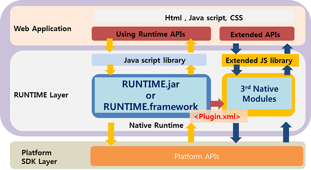

<!--
{
	"id": 6100,
	"title": "Cornerstone Runtime 기본구조",
	"outline": "Cornerstone Runtime 의 기본 구조를 설명 한다.",
	"tags": ["runtime"],
	"section": "Runtime",
	"order": [6, 1],
	"thumbnail": "6.1.00.runtime_structure.png"
}
-->

----------

# Cornerstone Runtime 기본구조 

----------

### Runtime 기본구조 

- 하이브리드앱 구조도

	- 하이브리드앱은 플랫폼앱으로 되어 있지만 내부에 웹페이지 형태 (ex - Cornerstone Framework)를 사용하는것을 의미하며 Cornerstone에서 제공하는 다양한 Device API를 사용하는 앱이라고 지칭한다.  

- Plugin 구조도

-	Cornerstone Runtime은 크게 Platform 별 Native Layer와 Java Script Layer의 2가지의 Layer로 나뉘어 진다. 

-	Native Layer는 각 플랫폼 별 Webview를 포함하여 사용한다. 

-	Native Layer는 각 플랫폼 별 사용되는 언어로 개발되어 있으며 Java Script Layer에서 요청된 Device API를 플랫폼 SDK를 이용하여 처리한다.  

  

### Runtime Java Script Layer 

-	Java Script Layer는 하이브리드앱에서 사용하기 위한 Java Script API들을 선언 및 정의 하며 이를 Runtime의 Native Layer와 연결하는 역할을 한다.

-	**SRT-x.x.js** 형태로 배포 되며 Runtime이 업데이트 될 때마다 버전명이 올라간다. 
		> **2013.09.16** 기준 Android - **SRT-0.9.3.js** , iOS - **SRT-0.9.2.js** 배포 

-	**SRT-x.x.js** 는 크게 두가지 역할로 구분된다. 

	-	Device API : 하이브리드앱에서 사용하는 Java Script API ProtoType 정의 
	-	exec module: Java Script API를 Native Runtime Library와 연결하여 통신하는 공통 인터페이스 모듈 
		-	Java Script의 prompt()함수를 Native 단에서 재정의하여 이를 Java Script와 Native의 연결 통로로 사용한다. 

 

----------

## Android Runtime 기본 구조 
 
### Android Native Layer 

-	Android Webview를 이용하여 Runtime Java Script Library에서 호출된 API로 부터 그에 해당하는 Native Class를 실행하고 성공/실패 콜백 전달하는 Layer

-	하이브리드앱에서 Device의 특정 기능을 수행하고 Webview를 사용하기 위하여 **Runtime.jar** 가 배포된다. 

	-	Runtime.jar는 Java Class로 구성되어 있는 Android용 Native Library 이다. 
	- 	Runtime.jar는 하이브리드앱의 index.html을 Load하는 파일을 포함 하고 있다. 
	- 	Runtime.jar는 Cornerstone Runtime에서 제공하는 Device API가 포팅되어 있다. 
	- 	Runtime.jar는 Native Code로 모듈화 되어 Android SDK 로 부터 작업을 수행하고 결과를 Java Script Layer에 반환 한다. 

 

### Android Project Files 

-	Android용 하이브리드앱을 개발하기 위해서는 아래와 같은 Project File 들을 세팅하여야 한다. 

	1) AndroidManifest.xml
	-	하이브리드앱의 고유한 **Package** 명 설정 

	2) res/value/string.xml 
	-	실제 Device에서 보여지는 **하이브리드앱의 이름** 설정 

	3)  res/drawable/icon.png
	-	실제 Device에서 보여지는 **아이콘** 설정 

 

----------

## iOS Runtime 기본 구조 

### iOS Native Layer

- UIWebview를 이용하여 Runtime Java Script Library에서 호출된 API로 부터 그에 해당하는 Native Class를 실행하고 성공/실패 콜백 전달하는 Layer

 - RuntimeDelegate : UIWebview를 생성하고 Runtime API를 연동
 - ViewController : UIWebview와 Device를 연결하고 Orientaion을 제어
 - Commands : Java Script API 를 Native Platform API를 통해서 구현
 - Utils : JSON / Base64 / ExtendMutableArray / ExtendMutableDictionary 라이브러리

- SRT.framework 라는 이름으로 배포된다.

 

### iOS Project Files

-	iOS용 하이브리드앱을 개발하기 위해서는 아래와 같은 Project File 들을 세팅하여야 한다. 

	1) SRT_Template-Info.plist
	- **iOS 어플리케이션 설정**을 위한 프로젝트 파일 , 실제 Device에서 보여지는 **하이브리드앱의 이름** 설정

	2) SRT.plist
	-	**Cornerstone Runtime 설정**을 위한 프로젝트 파일

	3) Resources
	-	Icon / Splash Screen 용 이미지 파일들

 
