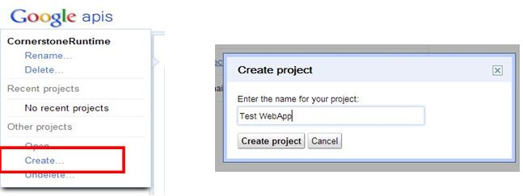
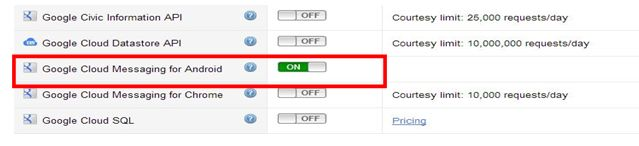
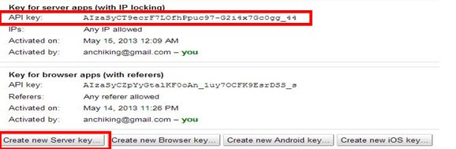
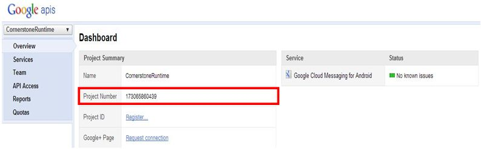
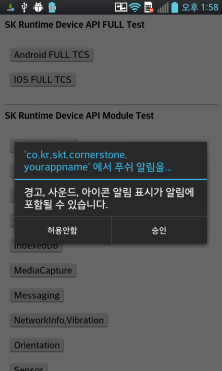
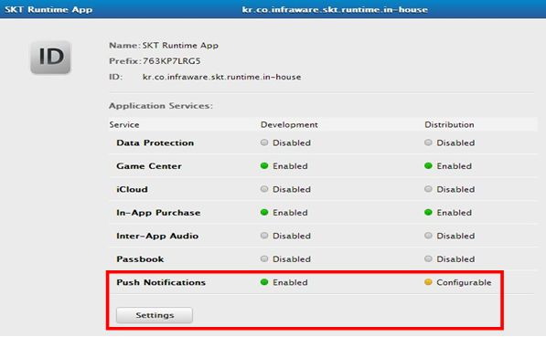
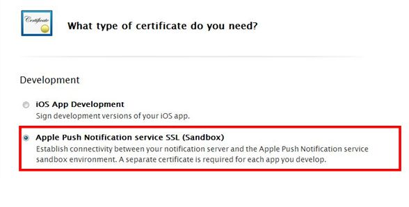
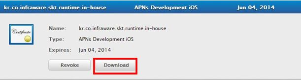
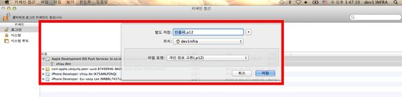

<!--
layout: 'post'
section: 'Cornerstone Framework'
title: 'Push Notification 사용 가이드'
outline: 'Cornerstone Push Notification 기능을 사용하기 위한 방법을 제공한다.'
date: '2012-11-16'
tagstr: 'runtime'
order: '[6, 6, 1]'
thumbnail: '6.2.00.android.png'
-->

----------

# Push Notification 사용 가이드

----------

## 1. Android GCM을 사용하기 위한 사전 작업 

 - Android용 Corenrstone Runtime 은 아래와 같은 절차를 통하여 하이브리드앱에서 Push Notification Service를 사용하도록 한다.

1) [https://code.google.com/apis/console](https://code.google.com/apis/console) 에서 Project를 생성하여 Project Number를를 생성한다. Project Number는 Client 앱에서 사용된다. 

2) [https://code.google.com/apis/console](https://code.google.com/apis/console) 에서 GCM service를 활성화 한다.

 
	
3) [https://code.google.com/apis/console](https://code.google.com/apis/console) 에서 API Key를 생성한다. API 키는 3rd Server에서 사용된다. 

4) 최종 생성된 Project를 확인한다. 

## 2. Android Cornerstone에서 Push Notification Service를 사용하기 위한 Runtime 내부 설정 작업  

1) Runtime 내부의 res/xml/config.xml 에 Push API 사용 여부와 생성한 Project Number를 입력한다. 

		<preference name="push" value="true"/>                 // push service 사용여부 작성 
		<preference name="projectkey" value="173065860433 "/>  // Project Number를 작성 

		<!-- 아래 "pushType" 항목을 작성하지 않을 경우 default는 "banner" 형태이다.  -->
		<preference name="pushType" value="banner"/>           // push display type -> banner 방식(default)
		<!-- <preference name="pushType" value="alert"/> -->   // push display type -> alert dialog 방식
		

2) Runtime 내부의 AndroidManifest.xml 에 Push Notification Service 사용을 위한 앱의 Package 명을 입력한다. 

- manifest 선언부분 : Package Name 입력 

		<!-- [ConerStone Runtime]input your packeage name -->
		<manifest xmlns:android="http://schemas.android.com/apk/res/android" 		   		
				android:windowSoftInputMode="adjustPan"
		 		package="co.kr.skt.cornerstone.yourappname" android:versionName="1.1"
    			android:versionCode="5"> 

- push service 사용부분 : Package Name 입력 

        <receiver
            android:name="com.google.android.gcm.GCMBroadcastReceiver"
            android:permission="com.google.android.c2dm.permission.SEND" >
            <intent-filter>
                <action android:name="com.google.android.c2dm.intent.RECEIVE" />
                <action android:name="com.google.android.c2dm.intent.REGISTRATION" />

                <!-- [ConerStone Runtime]input your packeage name -->
                <category android:name="co.kr.skt.cornerstone.yourappname" />
            </intent-filter>
        </receiver>

	     <!-- to use GCM -->
	     <!-- [ConerStone Runtime]input your packeage name -->
	    <permission
	        android:name="co.kr.skt.cornerstone.yourappname.permission.C2D_MESSAGE"
	        android:protectionLevel="signature" />
	
	    <!-- [ConerStone Runtime]input your packeage name -->
	    <uses-permission android:name="co.kr.skt.cornerstone.yourappname.permission.C2D_MESSAGE" />

3) Runtime 내부 src/yourpackagename/GCMIntentService.java 에 Project Number를 입력한다. 

		//서비스 생성자
		public GCMIntentService() {	
			//여기에 Project Number를 입력한다.  
			super("173065860439");
			
			Log.d(LOG_TAG,"GCM서비스 생성자 실행");
		}
4) 하이브리드앱 실행시 다음과 같은 대화창이 나왔을 경우 "승인" 을 눌러 GCM으로 부터 Registration ID 를 얻는다. 

 

5) 하이브리드앱 실행시 GCM 로부터 발급 받은 Registration ID 를 3rd Server 에 전송한다. 

 	-	하이브리드앱 개발자는 JavaScript API를 통하여 등록된 Registration ID 를 얻어올 수 있다.

		function successCallback(id){
			alert(id);
			// 3rd server에 registration id를 전송한다. 
		}
			function errorCallback(){
		}	
		navigator.push.getregistrationID(successCallback,errorCallback);

6) 3rd Server에서 API Key 와 5) 과정에서 얻은 Registration ID 이용하여 Device 에 Push Notification 을 전송한다.

- title		: push message의 제목 
- message 	: push message의 내용 
- geturl 	: push message를 확인 및 클릭 하였을때 Runtime이 load 하는 페이지 (GET 방식의 Argument 사용 가능).

		Message message = new Message.Builder()
		          			.addData("title", "공지사항")
		          			.addData("message", "메세지 내용을 입력하세요")
		          			.addData("getURL", "push_sample.html?arg1=test?arg2=11111")
		          			.build();

7) Android Platform 4.1 (젤리빈) 이하의 Device에서는 GET 방식의 Argument 사용이 불가능 하다. 
즉 push_sample.html?arg1=test?arg2=11111 를 load 한다 하더라도 Runtime은 push_sample.html을 load하며 뒤의 Argument 는 생략되는데 이를 사용하기 위하여 다음 API를 사용한다. 

		navigator.getCurrentURL(); // GET 방식의 Argument가 있을 경우 사용한다. 

## 3. Android Cornerstone에서 제공하는 Push Notification 관련 Java Script API 

1) Push Service 사용, 비사용을 컨트롤 할 수 있다. 

		function setPushUseTrue() {	
			navigator.push.enableService(setPushUsesuccessCallback,errorCallback,true);
		}
		function setPushUseFalse() {
			navigator.push.enableService (setPushUsesuccessCallback,errorCallback,false);
		}

	
2) Push Notification 타입을 결정 할 수 있다. 

		navigator.push.setDisplayType(successCallback,errorCallback,”TYPE_ALERT”);
		navigator.push.setDisplayType(successCallback,errorCallback,”TYPE_NOTIBAR”);

3) 현재 등록된 Registration ID를 얻어 올 수 있다. 

		function successCallback(id){
			alert(id);
		}
		function errorCallback(){
		}	

		navigator.push.getregistrationID(successCallback,errorCallback);

## 4. iOS APNS를 사용하기 위한 사전 작업 

 - iOS 용 Cornerstone Runtime 은 아래와 같은 절차를 통하여 하이브리드앱에서 Push Notification Service 를 사용하도록 한다.

 - 본과정에서 Apple 개발자 과정 등록은 완료 되었다는 가정하에 설명한다. 
    (개발자 인증서 등록 , App ID 생성 , 프로비저닝 프로파일 생성) 

1) [https://developer.apple.com](https://developer.apple.com) 의 Provisionong Portal – APP IDs 에서 Push Notification 을 활성화 한다. 

 

2) [https://developer.apple.com](https://developer.apple.com) 에서 Push Notification SSL 인증서를 생성 및 다운 받아 iOS 개발 환경에 시스템 인증서로 등록한다.  

 

 

3) 기 발급받은 CSR 인증서와 SSL 인증서를 묶어 .p12 확장자 형태의 파일로 저장한다.

    

4) 3) 과정에서 받은 .p12 파일을 3rd Server에 전송한다. 

5)	하이브리드앱 실행시 APNS로부터 발급 받은 Device Token 을 3rd Server에 전송한다. 

6)	3rd server 에서 4) 과정에서 받은 .p12  파일과 5) 과정에서 얻은 Device Token을 이용하여 Device 에 Push Notification을 전송한다. 

## 5. iOS Cornerstone에서 Push Notification Service를 사용하기 위한 Runtime 내부 설정 작업  

1) 하이브리드앱 실행시 Push 알림 대화창이 나왔을 경우 "승인" 을 눌러 APNS으로 부터 Registration ID를 얻는다. 

2) 하이브리드앱 실행시 APNS 로부터 발급 받은 Registration ID를 3rd server에 전송한다. 

 	-	하이브리드앱 개발자는 Java Script API를 통하여 등록된 Registration ID를 얻어올 수 있다.

		function successCallback(id){
			alert(id);
			// 3rd server에 registration id를 전송한다. 
		}
			function errorCallback(){
		}	
		navigator.push.getregistrationID(successCallback,errorCallback);

3) 3rd Server에서 2)과정에서 얻은 Registration ID 이용하여 Device 에 Push Notification을 전송한다.

		PayLoad payload = new PayLoad();
		payload.addAlert(alertMessage); 							// 보내고자 하는 message의 내용 
		payload.addCustomDictionary("loadurl" , "testindex.html"); 	// push message를 확인 및 클릭 하였을때 runtime이 load 하는 페이지
		payload.addCustomDictionary("query" , "arg1=test?arg2=11");	// get 방식의 argument

## 6. iOS Cornerstone에서 제공하는 Push Notification 관련 Java Script API 

1) 현재 등록된 Registration ID를 얻어 올 수 있다. 

		function successCallback(id){
			alert(id);
		}
		function errorCallback(){
		}	

		navigator.push.getregistrationID(successCallback,errorCallback);