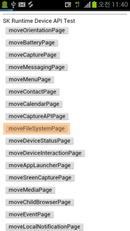
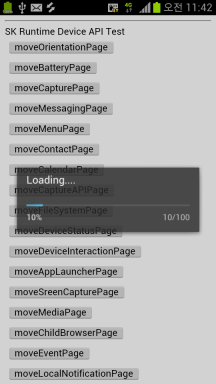

<!--
{
	"id": 6605 ,
	
	"title": "Progress-Bar 설정 가이드",
	"outline": "Cornerstone Runtime 하이브리드앱에서 웹페이지 로딩시 보여지는 ProgressBar 기능을 제공한다.",
	
	"tags" : ["runtime"],
	"order": [6, 6 , 5],
	"thumbnail": "6.2.00.android.png"
}
-->

-------------------

# Progress-Bar 설정 가이드

-------------------

## Cornerstone Runtime 하이브리드앱에서 웹페이지 로딩시 보여지는 Progress-Bar 기능

 - Cornerstone Runtime은 하이브리드앱에서 페이지 로드시에 보여지는 Progress-Bar 기능을 제공한다. 
 - Android인 경우에는 Progress-Bar 형태로 제공이 되며 , iOS 인 경우에는 Spinner 형태로 제공이 된다. 

## 1. Android ##

1) Cornerstone Runtime Template의 res/xml/config.xml에 다음을 기술 한다. 

		 <preference name="loadingprogressbar" value="navigator"/>  // 네비게이터 바에 loading progress-bar 사용
		 <preference name="loadingprogressbar" value="dialog"/> 	// dialog 형태로 loading progress-bar 사용 
		 <preference name="loadingprogressbar" value="none"/> 		// loading progress-bar 사용안함 (default) 

- Navigator 영역의 Progress-Bar

- Dialog 영역의 Progress-Bar

## 2. iOS ##

1) Cornerstone Runtime Template의 SRT_Template/Supporting Files/SRT.plist에 다음을 기술 한다.

		<key>ShowStatusbarSpinner</key>
		 	<Booelan>Yes</booelan>						// 네비게이터 바에 인디케이터바 스피너 보기/끄기 설정
		<key>ShowScreenSpinner</key>
		 	<Booelan>Yes</booelan>						// 화면 중앙의 스피너 보기/끄기 설정
		<key>ScreenSpinnerImages</key>					// 화면 중앙의 스피너 이미지 파일 리스트
		 	<array>
		  		<string>staus1.png</string>	
				<string>staus2.png</string>	
				<string>staus3.png</string>	
				<string>staus4.png</string>	
				<string>staus5.png</string>	
				<string>staus6.png</string>	
				<string>staus7.png</string>	
		 	</array>

