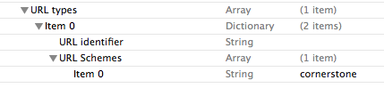

<!--
layout: 'post'
section: 'Cornerstone Framework'
title: 'Custom URL 사용 가이드'
outline: 'Native Browser에서 특정 URL링크를 클릭하였을 때 Conerstone Runtime 하이브리드앱을 실행시키는 방법을 제공한다. '
date: '2012-11-16'
tagstr: 'runtime'
order: '[6, 6 , 6]'
thumbnail: '6.2.00.android.png'
-->

---------------------------

# Custom URL 사용 가이드 

---------------------------

## Native Browser에서 특정 URL링크를 클릭하였을 때 Conerstone Runtime 하이브리드앱을 실행시키는 방법 

 - 특정 웹 페이지에서 Custom URL를 통하여 Cornerstone Runtime 하이브리드앱 실행 시킬 수 있도록 한다. 
예를 틀어 a link 를 통하여 특정 페이지에 링크를 걸었을 경우 Runtime을 이용한 하이브리드앱을 실행함을 목표로 한다. 

		<a href="cornerstone://testapp.co.kr/loadpage.html?arg1=1?arg2=test"> // Android 

		<a href="cornerstone://testapp.co.kr/loadpage.html?arg1=1?arg2=test"> // iOS 

## 1. Android ##

1) **cornerstone://srtapp.co.kr/nfc_sample.html?args1=test?args2=test1** 와 같은 GET 형식을 이용한다. 
각 항목별 설명은 다음과 같다 

- corenrstone  -> Corenrstone Custom Scheme
- sttapp.co.kr -> URL이 클릭되었을 경우 실행되는 Host 
- nfc_sample.html -> 실행되는 앱에서 Load 되는 페이지 
- arg1=1?arg2=test-> Load 되는 페이지에 전달되는 매개변수 

2) Runtime Template의 AndroidManifest.xml 파일에 다음을 수정한다. 

		<!-- CustomURL activity for receive uri broadcast from browser -->
        <activity android:name=".UriReceiver" >
            <intent-filter>
                <action android:name="android.intent.action.VIEW" />

                <category android:name="android.intent.category.DEFAULT" />
                <category android:name="android.intent.category.BROWSABLE" />
				<!-- [Cornerstone] host에 사용자가 원하는 host를 입력한다. -->
				<data
                    android:host="srtapp.co.kr"
                    android:scheme="cornerstone"/>
            </intent-filter>
        </activity>

3) Android 는 Platform 이슈로 인하여 안드로이드 플랫폼 젤리빈 (4.1) 이상에서만 동작한다. 젤리빈 (4.1) 미만의 Android Device 는 Custom URL Scheme이 요청 되었을 때의 URL을 Java Script API를 통하여 얻을 수 있도록한다.

		// 젤리빈 이상의 단말 
		Alert(href.location) ; 

		// 젤리빈 이하의 단말 
		Alert(Navigator.getCurrentURL());

## 2. iOS ##

1) **cornerstone://srtapp.co.kr/nfc_sample.html?args1=test?args2=test1** 와 같은 GET 형식을 이용한다. 
각 항목별 설명은 다음과 같다 

- corenrstone      -> Corenrstone Custom scheme
- srtapp.co.k      -> iOS는 의미 없는 값이다. 다만 Android와의 형식을 맞추기 위하여 작성한다. (Package Name)  
- nfc_sample.html  -> 실행되는 앱에서 Load 되는 페이지 (www 폴더 내부에 존재하여야 한다.) 
- arg1=1?arg2=test -> Load 되는 페이지에 전달되는 매개변수 

2) Runtime Template 의 SRT-Template/Supporting Files/SRT_template-info.plist 파일에 다음을 수정한다. 

 

	- URL Schemes 의 item 0 항목에 사용자 지정 Custom Scheme를 작성한다. 

