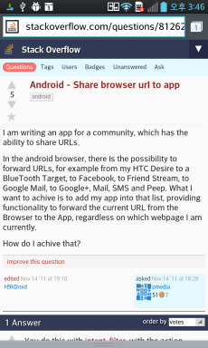
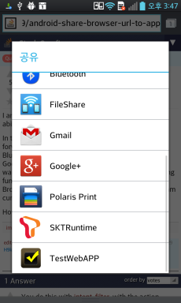
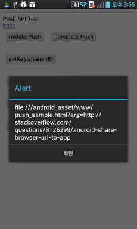

<!--
layout: 'post'
section: 'Cornerstone Framework'
title: 'Browser Share 사용 가이드'
outline: 'Android Browser에서 특정 URL을 Cornerstone Runtime에 공유하는 방법을 제공한다.'
date: '2012-11-16'
tagstr: 'runtime'
order: '[6, 6, 7]'
thumbnail: '6.2.00.android.png'
-->

---------------------------

# Browser Share 사용 가이드 

---------------------------

## Android Browser에서 특정 URL을 Cornerstone Runtime에 공유하는 방법 

 - 아래 그림과 같이 Native Browser의 특정 URL을 공유하여 이를 Runtime 에서 사용 할 수 있다. 

1) Runtime Template 내부의 yourpackagename/RuntimeStandAlone.java 공유된 URL과 함께 Load 되어야 할 URL 주소를 입력한다. 
 
 			if ("text/plain".equals(type)) {
        		 String sharedText = i.getStringExtra(Intent.EXTRA_TEXT);
        		    if (sharedText != null) {
        		    	Log.e("BrowserToRuntime", sharedText);
        		    	
        		    	//[CornerstoneRuntime] : input your page to load with argument 
						//특정 html 주소뒤에 "?arg=" 를 입력한다. 
						//Browser로 부터 공유된 URL을 GET 방식의 Argument로 사용한다. 
        		    	openPage = BASE_URL + "push_sample.html?arg=" + sharedText;
        		    }
        	 }

2) 아래 그림과 같이 Load된 URL의 Argument에 Browser로 부터 공유된 URL을 사용할 수 있다. 

-	Android 플랫폼 젤리빈(4.1) 이하에서는 navigator.getCurrentURL();을 사용한다. 

		navigator.getCurrentURL(); // GET 방식의 Argument가 있을 경우 사용한다. 

-   Android 플랫폼 젤리빈(4.1) 이상에서도 navigator.getCurrentURL();을 사용한다. 

		4.1 이상의 단말이라고 하더라도 arg영역에 http:// 및 https:// 가 포함되어 있는 경우 webview가 
		로드를 하지 못한다. 

