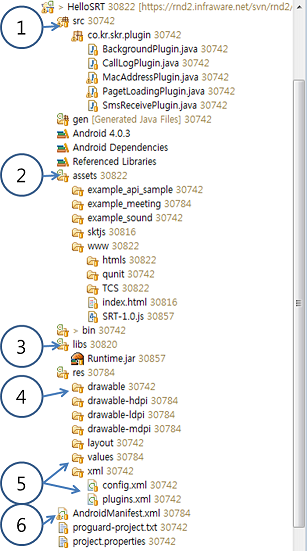
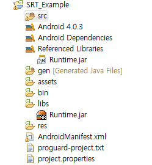
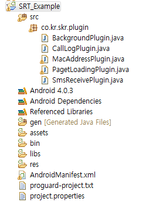
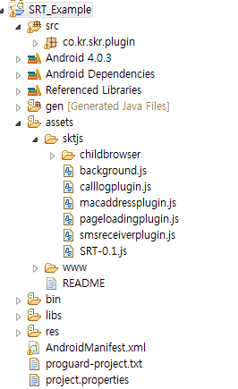
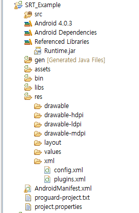
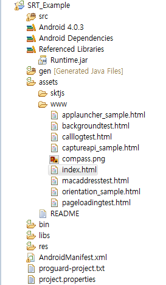
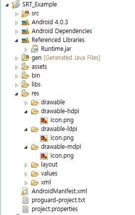
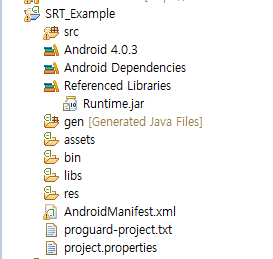
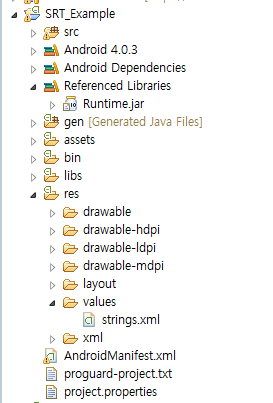

<!--
layout: 'post'
section: 'Cornerstone Framework'
title: 'Android PlugIn 개발'
outline: '아래 링크를 통하여 확장구조 개발에 필요한 Android Native source와 JavaScript source 예제를 참조할 수 있다.'
date: '2012-11-16'
tagstr: 'runtime'
order: '[6, 7]'
thumbnail: '6.7.00.android.png'
-->

##	Android Runtime 확장 구조 개발 

### Android Runtime 확장 구조 개발 환경

 

-	아래 링크를 통하여 확장구조 개발에 필요한 Android Native source와 JavaScript source 예제를 
참조할 수 있다. 

[./sample/Android_plugin_sample.zip](./sample/Android_plugin_sample.zip "Android plugin 개발 예제 소스 ")

1) src - plugin 개발시에 작성하는 **Java Native Code**

2) asset - 실제 웹앱의 웹 리소스(HTML/CSS/JS/IMG) 와 Runtime JavaScript Library 가 저장되는 위치 
	
-	**assets/www** : 웹앱의 저장 위치 
-	**assets/www/index.html** : 웹앱의 첫 실행 파일 

3) libs - Webview 를 이용하여 Device 의 단말 접근 기능을 제공하는 DeviceAPI가 포팅된 Android 
Library 위치 

-	**Runtime.jar** : webview 및 DeviceAPI가 포팅된 JAVA library

4) drawable - device에 보여지는 icon 및 splash image를 저장하는 위치 

-	**icon.png** : device에 보여지는 icon
-	**splash.png** : 웹앱 실행 초기에 보여지는 splash image (optional) 

5) values , xml - 웹앱의 name 및 runtime setting을 할 수 있는 폴더 

-	**plugin.xml** : plugin을 Runtime에 등록하는 파일 
-	**value/string.xml** : 웹앱의 name을 세팅하는 파일 
-	**xml/config.xml** : device의 orientation(portrait , landscape , audo) 및 splash image를 세팅 하는 파일 

6) AndroidManifest.xml : 하나의 Native Application으로써의 고유한 Package 명을 지정하는 파일, 하드웨어 가속 GPU 렌더링 사용여부를 지정하는 파일.

 

### Android Runtime 확장 구조 개발 절차 

**step 1.**  Authoring tool을 이용해 Android Web App Template를 받으면 Lib 폴더에 **Runtime.jar가 기본으로 포함**되어 있다.

**step 2.**  확장 구조 개발자는 아래의 그림과 같이 src 폴더의 .java 파일에 추가할 native 모듈에 대한 정의를 한다. 

- src 폴더를 생성한다. 

- package 명을 지정한다. 이는 plugin.xml에 입력될 값이다. 

	> example - co.kr.skr.plugin	

- native 모듈을 개발을 위한 .java 파일을 생성한다. 

	-	Plugin class 를 **extends** 한다. 
	-	**execute** 함수를 재정의 한다. 

	> example code 

		public class pluginEx extends Plugin{

			@Override
			public PluginResult execute(String arg0, JSONArray arg1, String callbackId) {
				
				// TODO Auto-generated method stub
				
				return null;
			}
		}

-	execute 함수 내부에 native api를 이용하여 특정 기능을 구현 한다. 

	-	return 형은 PluginResult 이다. PluginResult 객체에 status와 필요하다면 JavaScript에 전달 할 message를 입력한다. 
	
		1) 특정 기능이 성공적으로 완료된 경우 (JavaScript SuccessCallback 호출)  

		`return new PluginResult(Status.OK, returnObj);`

		2) 특정 기능이 실패 한 경우 (JavaScript ErrorCallback 호출)  

		`return new PluginResult(Status.ERROR, errorObj);`

		3) 별도의 JavaScript 알림이 필요 없는 경우 

		`return new PluginResult(Status.NO_RESULT);`

 
	> example code (MacAddress plugin)

			@Override
			public PluginResult execute(String action, JSONArray args, String callbackId) {
					
				this.callbackId = callbackId;
				
				//action은 JavaScript에서 정의한 extension api 명이다. 
	
				//device의 MacAddress를 얻는 기능 
				if(action.equalsIgnoreCase("getMacAddress")){		
					WifiInfo wifiInfo = wifiManager.getConnectionInfo();
					String macAddress = wifiInfo.getMacAddress();
					
					PluginResult result = new PluginResult(PluginResult.Status.OK, macAddress);
					return result;
				}
				else if(action.equalsIgnoreCase("getDeviceID")){		
					String android_id = Secure.getString(ctx.getContentResolver(), Secure.ANDROID_ID);
					
					PluginResult result = new PluginResult(PluginResult.Status.OK, android_id);
					return result;
				}
				//device의 개통된 번호를 얻는 기능 
				else if(action.equalsIgnoreCase("getPhoneNumber")){
					String phoneNumber = tm.getLine1Number();
					return new PluginResult(PluginResult.Status.OK, phoneNumber);
				}
				
				return new PluginResult(PluginResult.Status.NO_RESULT);
			}

-	**setContext** 함수를 재정의 하여 plugin 로딩시 초기화 작업 및 API가 호출되기 전의 특정 작업을 수행 할 수 있다. 

	> example code (MacAddress plugin)

			@Override
			public void setContext(RuntimeInterface ctx) {
				// TODO Auto-generated method stub
				super.setContext(ctx);
				
				wifiManager = (WifiManager)ctx.getSystemService(Context.WIFI_SERVICE);
				tm = (TelephonyManager) ctx.getSystemService(Context.TELEPHONY_SERVICE);
			}

-	**isSynch** 함수를 재정의 하여 특정 API에 대하여 동기적으로 동작하게 함수를 개발 할 수 있다. 특정 api에 대하여 재정의 하지 않는다면 API는 비동기로 동작한다. 

	> example code (MacAddress plugin)

			@Override
				public boolean isSynch(String action) {
					//getMacAddress api는 동기적으로 동작 
					if(action.equals("getMacAddress"))
						return true;
					else if(action.equals("getDeviceID"))
						return true;
					else if(action.equals("getPhoneNumber"))
						return true;
					
					return super.isSynch(action);
				}

- **execute** 함수의 3번째 매개변수(callbackId)를 이용하여 JavaScript callback에 Native에서 pluginResult 객체를 지속적으로 return 할 수 있다. 

	> example code ( Plugin.success() api를 이용하여 callback을 보내는 방법) 
		
		@Override
		public PluginResult execute(String action, JSONArray args, String callbackId) {
		JSONObject obj = args.optJSONObject(0);	

			if(action.equalsIgnoreCase("for")){
	
				int end = obj.optInt("end");		
				int i = obj.optInt("start");
	
				//현재 action에 대한 callback ID를 내부에 저장한다. 
				this.callbackId = callbackId;
				threadstop = false;
	
				do{
					i++;
					if(i%1000 == 0){
						PluginResult result = new PluginResult(PluginResult.Status.OK, i);

						// result를 setKeepCallback(true) 로 설정한다. 
						// 위와 같이 설정 하면 JS library에서 callback을 delete 하지 않는다. 
						// default는 false이다. 
						result.setKeepCallback(true);	
					
						// action에 대한 calbakcId에 result를 지속적으로 보낼 수 있다. 
						this.success(result, this.callbackId);
					}
					else if(i == end){
						threadstop = true;
						PluginResult result = new PluginResult(PluginResult.Status.OK, "stop");
					
						// result를 setKeepCallback(false) 로 설정한다
						result.setKeepCallback(false);			
						// action에 대한 calbakcId에 result를 마지막으로 보낸다.
						// result의 keepCallback이 false이기 때문에 JS lib에서 callback을 delete한다. 
						this.success(result, this.callbackId);
					}	
	
				}while(!threadstop);
			}
	
			return new PluginResult(PluginResult.Status.NO_RESULT);
		}

**step 3.**  확장 구조 개발자는 아래의 그림과 같이 asset 폴더의 .js 파일에 추가할 JavaScript 모듈에 대한 정의를 한다. 

-	asset 폴더 내에 JavaScript plugin 을 위한 .js 파일을 생성한다. 

-	JavaScript plugin 객체를 생성한다.
 
	> code example

	`var MacAddress = function() {};`

-	JavaScript Extension API 의 prototype을 정의 한다. 

	> code example 1 (SuccessCallback, ErrorCallback , 매개변수가 없는 api) 

		MacAddress.prototype.getMacAddress = function() {
		//do sync
		var macAddress = srt.exec(null, null, 'MacAddress', 'getMacAddress', []);
		return macAddress;
		};
	
	> code example 2 (SuccessCallback, ErrorCallback , 매개변수가 있는 api) 

		MacAddress.prototype.list = function(successCallback, failureCallback,params) {
		srt.exec(successCallback, failureCallback, 'MacAddress', 'list', [ params ]);
		};

- 	JavaScript plugin 객체를 Cornerstone Runtime JavaScript Library의 plugin으로 등록 한다. 

	> code example 

		srt.addConstructor(function() {
			//window.plugin.MacAddress 로 javascript 에 노출 된다. 
			srt.addPlugin('MacAddress', new MacAddress());
		});

> Full Example (MacAddressPlugin.js) 
	
	var MacAddress = function() {};
	
	MacAddress.prototype.getMacAddress = function() {
		//do sync
		var macAddress = srt.exec(null, null, 'MacAddress', 'getMacAddress', []);
		return macAddress;
	};
	
	MacAddress.prototype.list = function(successCallback, failureCallback,params) {
		srt.exec(successCallback, failureCallback, 'MacAddress', 'list', [ params ]);
		};
	
	MacAddress.prototype.getDeviceID = function() {
		//do sync
		var deviceID = srt.exec(null, null, 'MacAddress', 'getDeviceID', []);
		return deviceID;
	};
	
	srt.addConstructor(function() {
		srt.addPlugin('MacAddress', new MacAddress());
	});

**step 4.**  플러그 인을 Runtime에 등록하고자 할 때에는 개발한 plugin 이름과 실제 구현된 java파일 위치를 **res/xml/plugin.xml** 파일에 작성한다.

-	name 은 JavaScript 등록을 위해 srt.addPlugin() 에 등록되었던 이름이다. 
-	value 는 실제 Java 파일이 작성된 package의 full path 이다. 

	>	plugin.xml 

   	 `<plugin name="MacAddress" value="co.kr.skr.plugin.MacAddressPlugin" />`

	 `<plugin name="CallLog" value="org.skt.runtime.plugin.CallLogPlugin" />`
	

**step 5.** 웹앱의 시작 파일은 반드시 index.html 이어야 한다. **SRT-1.0.js는 플러그인 개발 환경 template의 기본 포함된 파일**이다. 

-	특정 웹페이지 내부에서 DeviceAPI를 사용하고 할 때에는 아래와 같이 JavaScript Library를 선언한다.
 
	``

-	특정 웹페이지 내부에서 추가된 Plugin을 사용하고 할 때에는 아래와 같이 JavaScript Library를 선언한다.

>	Example 1. MacAddress Plugin 사용 예제 
 
		
		

>	Example 2. CallLog Plugin 사용 예제 

		
		<title>CallLog Test</title>
		

**step 6.**  Res 폴더 내부에 웹앱 개발자가 사용하고자 하는 아이콘 이미지를 **icon.png**의 이름으로 삽입한다. 

**step 7.** AndroidManifest.xml 파일 내부의 package 명을 개발자가 변경을 해줘야 한다. 이는 고유한 값으로 Android 시스템 내부의 중복된 어플이 설치되지 않도록 한다. 

-	기본적인 Manifest 파일의 형식 

		<manifest xmlns:android="http://schemas.android.com/apk/res/android" android:windowSoftInputMode="adjustPan"
    	package="co.kr.skt.testapp.test" android:versionName="1.1" android:versionCode="5">

- GPU 하드웨어 가속 렌더링을 사용하고 싶다면 아래와 같이 application tag에 hardwareAccelerated 를 true로 설정 한다. 이는 웹 앱이 디바이스에서 사용하는 메모리 점유율을 늘어나지만 부드러운 2D image 렌더링을 가능하게 한다. (default는 생략됨) 

		<application android:icon="@drawable/icon" android:label="@string/app_name" android:hardwareAccelerated="true" android:debuggable="true">

**step 8.** Application의 실제 단말기에서 보여지는 이름을 **string.xml의 app_name**에 정의한다.

-	string.xml

		<resources>
  		<string name="app_name">테스트웹앱</string> 
		</resources>

**step 9.** Eclipse의 빌드 아이콘을 이용하여 Android App을 빌드하여 Device에 정상적으로 설치됨을 확인한다. 

**step 10.** Device에 WebApplication이 정상적으로 출력됨을 확인한다. 

