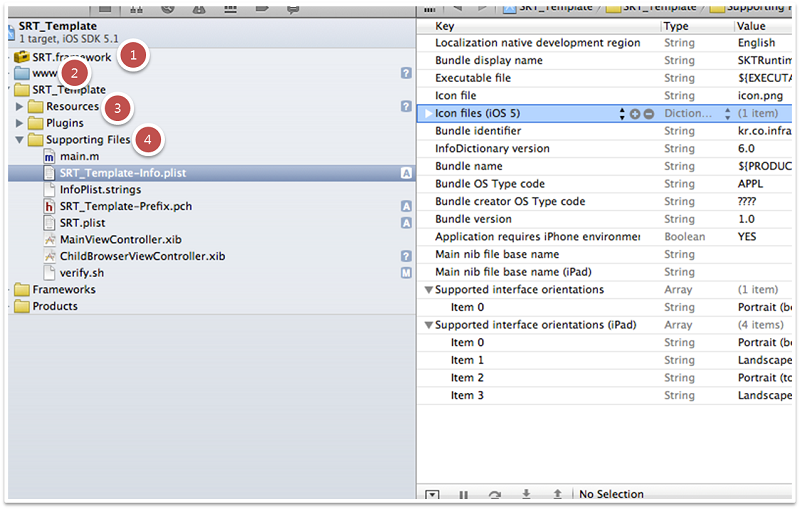
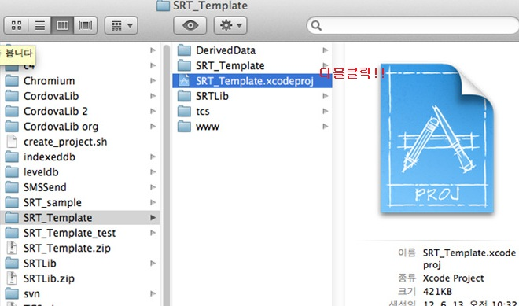
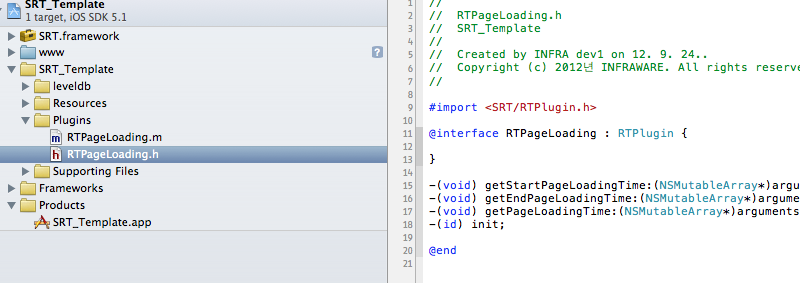
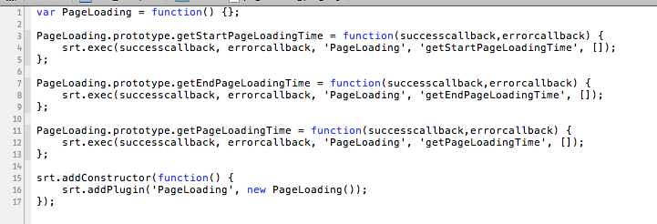
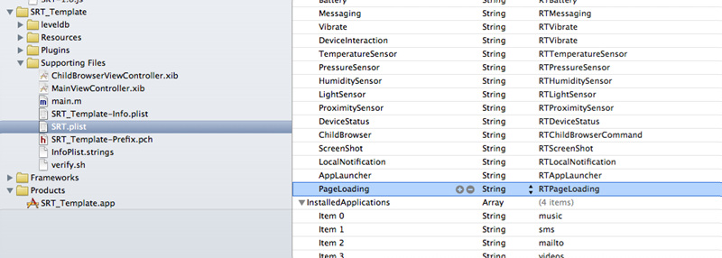
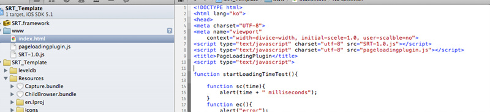
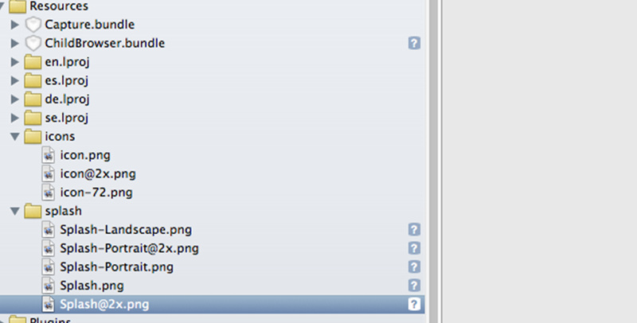
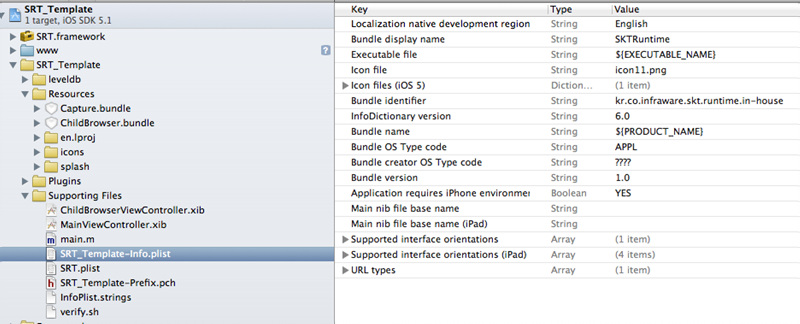
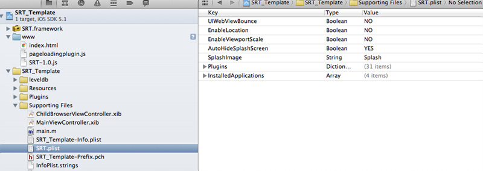
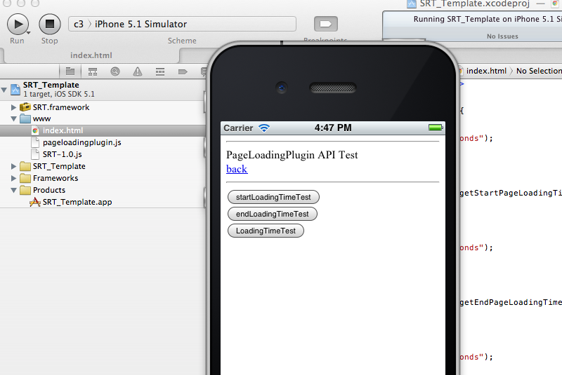

<!--
layout: 'post'
section: 'Cornerstone Framework'
title: 'iOS PlugIn 개발'
outline: '아래 링크를 통하여 확장구조 개발에 필요한 iOs Native source와 JavaScript source 예제를 참조할 수 있다.'
date: '2012-11-16'
tagstr: 'runtime'
order: '[6, 8]'
thumbnail: '6.8.00.iOS.png'
-->

##	iOS Runtime 확장 구조 개발 

### iOS Runtime 확장 구조 개발 환경

 

-	아래 링크를 통하여 확장구조 개발에 필요한 iOs Native source와 JavaScript source 예제를 
참조할 수 있다. 

[./sample/iOS_plugin_sample.zip](./sample/iOS_plugin_sample.zip "iOS plugin 개발 예제 소스 ")

1) SRT.framework - Cornerstone Runtime Library

2) www - 실제 웹앱의 웹 리소스(HTML/CSS/JS/IMG) 와 Cornerstone Runtime JavaScript Library 가 저장되는 위치 

-	**www** : 웹앱의 저장 위치 
-	**www/index.html** : 웹앱의 첫 실행 파일
-	**www/SRT-1.0.js** : Cornerstone Runtime JavaScript Library

3) SRT_Template/Resources - 어플에 필요한 리소스를 저장하는 위치

-	**icons** : Icon을 위한 이미지 폴더
-	**splash** : splash screen을 위한 이미지 폴더

4) SRT_Template/Supporting Files - 앱 및 런타임 설정 파일이 위치하는 폴더

-	**SRT_Template-Info.plist** : iOS 앱을 위한 설정 파일
-	**SRT.plist** : Cornerstone Runtime을 위한 설정 파일
-	**Plugins** : 확장구조를 위한 폴더

 

### iOS Runtime 확장 구조 개발 절차 

**step 1.**  Authoring tool을 이용해 iOS SRT_Template를 받아서 SRT_Template.xcodeproj 파일을 연다

**step 2.**  확장 구조 개발자는 아래의 그림과 같이 SRT_Template/Plugins 에 추가할 native 모듈에 대한 정의를 한다. 

- native 모듈을 개발을 위한 Objective-C 헤더 파일을 생성한다. 

	-	SRT Framework의  RTPlugin.h 파일을 import 한다.
	-	클래스 생성시 RTPlugin class 를 상속 받는다.
	-	Javascript에서 불리울 함수를 선언한다. 함수 파라메터는 아래와 같다.

			-(void)FUNCTIONNAME:(NSMutableArray*)arguments withDict:(NSMutableDictionary*)options;
		
	> full example code (RTPageLoading.h)

			#import <SRT/RTPlugin.h>
			
			@interface RTPageLoading : RTPlugin {
			    
			}
			
			-(void) getStartPageLoadingTime:(NSMutableArray*)arguments withDict:(NSMutableDictionary*)options;

			@end

- native 모듈을 개발을 위한 Objective-C 소스 파일을 생성한다.

	- 헤더에서 선언한 함수를 정의한다.

		1) Javascript에서 array 형식으로 파라메터 전달시에는 NSMutableArray* **arguments** 로 전달 된다.

		2) Javascript에서 구조체 형식으로 파라메터 전달시에는 NSMutableDictionary* **options** 로 전달 된다.

	-	return 형은 RTPluginResult 이다. RTPluginResult 객체에 status와 message를 담는다. message는 생략 가능하다.
	
		1) status : 성공 , message : double형태로 전달인 경우  

			RTPluginResult* result = [RTPluginResult resultWithStatus:RTCommandStatus_OK messageAsDouble:123456.789];

		2) status : 성공 , message : dictionary 형태로 전달인 경우 

			RTPluginResult* result = [RTPluginResult resultWithStatus:RTCommandStatus_OK messageAsDictionary:anydict];

		3) status : 실패 인 경우

			RTPluginResult* result = [RTPluginResult resultWithStatus:RTCommandStatus_ERROR];

	-	Accelerometer와 같이 지속적으로 콜백을 호출하는 경우에는 RTPluginResult에 setKeepCallback API를 호출하여 설정 한다. 설정하지 않으면 콜백은 1회성으로만 전달된다.

			[result setKeepCallback:[NSNumber numberWithBool:YES]];

	-	RTPluginResult 타입은 writeJavascript 함수를 통해 자바스크립트로 전달 가능하다.   callbackID를 이용하여 호출자로 전달하며 callbackID는 arguments array의 첫번째 값이며 NSString 형태로 전달 된다. 

		1) callback id를 전달 받는 경우

			NSString* callbackId = [arguments objectAtIndex:0];

		2) 호출자(javascript api)의 성공 콜백을 부르는 경우

			[super writeJavascript:[result toSuccessCallbackString:callbackId]]; 

		3) 호출자(javascript api)의 실패 콜백을 부르는 경우

			[super writeJavascript:[result toErrorCallbackString:callbackId]];

	> full example code (RTPageLoading.m)

			#import "RTPageLoading.h"
			
			@implementation RTPageLoading
			
			-(void) getStartPageLoadingTime:(NSMutableArray*)arguments withDict:(NSMutableDictionary*)options {
			    NSString* callbackId = [arguments objectAtIndex:0];
			    RTPluginResult* result = [RTPluginResult resultWithStatus:RTCommandStatus_OK messageAsDouble:123456.789];
			    [super writeJavascript:[result toSuccessCallbackString:callbackId]]; 
			}
			
			@end

		}

**step 3.**  확장 구조 개발자는 아래의 그림과 같이 www 폴더의 .js 파일에 추가할 JavaScript 모듈에 대한 정의를 한다. 

-	asset 폴더 내에 JavaScript plugin 을 위한 .js 파일을 생성한다. 

-	JavaScript plugin 객체를 생성한다.
 
	> code example

	`var PageLoading = function() {};`

-	JavaScript Extension API 의 prototype을 정의 한다. 

	> code example 1 (SuccessCallback, ErrorCallback , 매개변수가 없는 api) 

		PageLoading.prototype.getStartPageLoadingTime = function() {
			srt.exec(null, null, 'PageLoading', 'getStartPageLoadingTime', []);
		};
	
	> code example 2 (SuccessCallback, ErrorCallback , 매개변수가 있는 api) 

		PageLoading.prototype.list = function(successCallback, failureCallback,params) {
			srt.exec(successCallback, failureCallback, 'PageLoading', 'list', [ params ]);
		};

- 	JavaScript plugin 객체를 Cornerstone Runtime JavaScript Library의 plugin으로 등록 한다. 

	> code example 

		srt.addConstructor(function() {
			//window.plugin.PageLoading 로 javascript 에 노출 된다. 
			srt.addPlugin('PageLoading', new PageLoading());
		});

> Full Example (PageLoading.js) 
	
	var PageLoading = function() {};
	
	PageLoading.prototype.getStartPageLoadingTime = function() {
		srt.exec(null, null, 'PageLoading', 'getStartPageLoadingTime', []);
	};
	
	PageLoading.prototype.list = function(successCallback, failureCallback,params) {
		srt.exec(successCallback, failureCallback, 'PageLoading', 'list', [ params ]);
	};
	
	srt.addConstructor(function() {
		srt.addPlugin('PageLoading', new PageLoading());
	});

**step 4.**  플러그 인을 Runtime에 등록하고자 할 때에는 개발한 js plugin 이름과 실제 구현된 Objective-C 클래스 이름을 SRT.plist 의 Plugins 의 Key / Value로 등록한다

-	key 는 JavaScript 등록을 위해 srt.addPlugin() 에 등록되었던 이름이다. 
-	value 는 plugin Objective-c 클래스 명이다.  

	>	plugin.xml 

		<key>Plugins</key>
			<dict>
				<key>PageLoading</key>
				<string>RTPageLoading</string>
			</dict>

	

**step 5.** 웹앱의 시작 파일은 반드시 index.html 이어야 한다. **SRT-1.0.js는 template 기본 파일**이다. 

-	특정 웹페이지 내부에서 DeviceAPI를 사용하고 할 때에는 아래와 같이 JavaScript Library를 선언한다.
 
	``

-	특정 웹페이지 내부에서 추가된 Plugin을 사용하고 할 때에는 아래와 같이 JavaScript Library를 선언한다.

	``

>	Full Example 1. PageLoading Plugin(index.html) 사용 예제 
 

	<!DOCTYPE html>
	<html lang="ko">
	<head>
	<meta charset="UTF-8">
	<meta name="viewport" context="width-divice-width, initial-scele-1.0, user-scalble=no">
	
	
	<title>PageLoadingPlugin</title>
	
	</head>
	
	
 PageLoadingPlugin API Test 
	<button onclick="startLoadingTimeTest();">startLoadingTimeTest</button> 
	</body>
	</html>

>	Example 2. CallLog Plugin 사용 예제 

		
		<title>CallLog Test</title>
		

**step 6.**  Resources/icons 폴더 내부에 웹앱 개발자가 사용하고자 하는 아이콘 이미지를 프로젝트에 추가한다. 기본으로 설정된 icon 파일 이름은 **icon**이며 기본 설정일 경우 단말에 따라 적용되는 icon 파일 이름은 아래와 같다. icon 파일 이름 설정 방법은 step 5. 에서 다룬다.

- **icon.png** : Iphone 3GS 이전 모델 용 아이콘 이미지
- **icon@2x.png** : iphone 4/4s 용 아이콘 이미지
- **icon-72.png** : ipad / ipad2 용 아이콘 이미지
- **icon-72@2x.png** : new ipad 용 아이콘 이미지

**step 7.** Resources/splash 폴더 내부에 웹앱 개발자가 사용하고자 하는 스플래쉬 이미지를 추가한다.  기본으로 설정된 splash 파일 이름은 **Splash**이며 기본 설정일 경우 단말에 따라 적용되는 splash 파일 이름은 아래와 같다. splash 파일 이름 설정 방법은 step 6.에서 다룬다 

참고로 스플래쉬 이미지란 웹앱 실행시 웹앱이 로딩될때까지 보여지는 이미지 화면을 뜻한다.

- **Splash.png** : Iphone 3GS 이전 모델용 스플래쉬 이미지
- **Splash @2x.png** : iphone 4/4s 용 스플래쉬 이미지
- **Splash-Landscape.png** : ipad / ipad2 용 가로 스플래쉬 이미지
- **Splash-Portrait.png** : ipad / ipad2 용 세로 스플래쉬 이미지
- **Splash-Landscape@2x.png** : new ipad 용 가로 스플래쉬 이미지
- **Splash-Portrait@2x.png** : new ipad 용 세로 스플래쉬 이미지

**step 8.** Supporting Files/SRT_Template-Info.plist 파일을 수정하여 어플의 여러 속성 설정이 가능하다. 이는 Cornerstone Runtime 프로젝트 뿐만이 아니라 iOS 어플 공통 적용사항이다. 아래는 주요 설정 값들이다.

- **Bundle display name** : 어플명
- **Icon files / Icon files(iOS5)** : 아이콘 이미지 파일 이름명
- **Bundle identifier** : 어플 고유 ID. 실제 단말 연동을 위해서는 애플사에 개발자 인증(provisioning profile)을 받아야하며 그때 설정한 ID를 넣는다.
- **Supported interface orientations / Supported interface orientations(ipad)** : 해당 어플이 지원하는 화면 회전 허용값. 예를 들어 Portrait(bottom home button)만이 설정되어 있다면 iPAD에서 회전을 하여도 실제로 화면이 회전되지 않는다.

**step 9.** Supporting Files/SRT.plist 파일을 수정하여 Cornerstone Runtime의 여러 속성 설정이 가능하다. 

- **UIWebViewBounce** : 화면 드래그를 끝까지 했을 경우 웹뷰가 바운스 효과를 내는지 여부를 설정함.
- **EnableLocation** : 해당 어플이 Geolocation 을 설정할수 있는지 여부를 설정
- **EnableViewportscale** : 뷰포트 확대/축소 허용 여부를 설정
- **AutoHideSplashScreem** : Yes일 경우 DeviceReady가 되면 자동으로 스플래쉬 스크린이 해제된다. No일 경우 API를 통해서 원하는 시점에 해제가 가능하다
- **SplashImage** : 스플래쉬 스크린을 위한 이미지 파일명 설정. 기본은 "Splash"로 설정되어 있다.
- **Plugins** : Cornerstone Runtime JS 라이브러리와 Native Class간의 연동을 위한 Map이다.
Key의 경우 JS 라이브러리를 위한 모듈명이며 Value의 경우 NativeClass 모듈명이다.
3rd 파티 개발자가 추가 플러그인을 개발할 경우에 사용한다.
- **InstalledApplications** : AppLauncher 모듈의 getInstalledApplications API 사용시 검색 가능한 어플리스트. 개발자가 어플리스트를 설정하면 getInstalledApplications API를 통해 어플 리스트중 실제 단말에 설치된 어플의 리스트를 가져올 수 있다. 어플리스트는 불려지는 어플에 설정된 URL Schemes에 설정된 값으로 리스트를 설정한다. 기본 설정은 기본 탑재 어플인 music, sms, mailto, videos 4가지가 설정되어 있다. 

**step 10.** Run을 눌러서 실제 단말에서 웹앱이 정상적으로 실행되는지 확인한다. 

