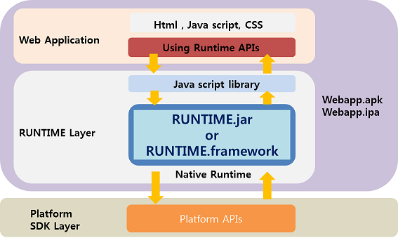
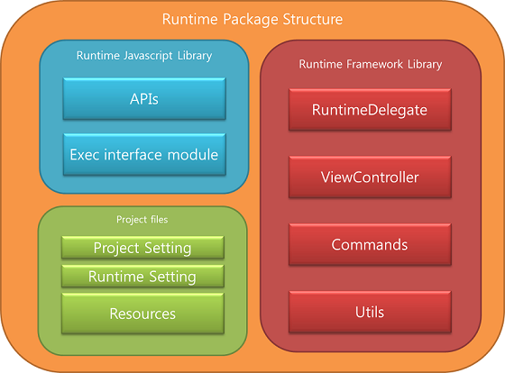

<!--
layout: 'post'
section: 'Cornerstone Framework'
title: 'Runtime 기본구조'
outline: '런타임 기본구조'
date: '2012-11-16'
tagstr: 'runtime'
subsection: 'Runtime for WebApp'
order: '[7, 1]'
-->

----------

# 1. Cornerstone Runtime 기본구조 

----------

## 1.1 공통 Runtime 기본구조 

-	Cornerstone Runtime은 크게 platform 별 Native Layer와 Java Script Layer의 2가지의 layer로 나뉘어 진다. 

-	Native layer는 각 플랫폼 별 Webview를 포함하여 사용한다. 

-	Native layer는 각 플랫폼 별 사용되는 언어로 개발되어 있으며 JavaScript layer에서 요청된 DeviceAPI 를 플랫폼 SDK를 이용하여 처리된다.  

  

### 1.1.1 Runtime JavaScript layer 

-	Java Script layer는 웹앱에서 사용하기 위한 JavaScript API들을 선언 및 정의 하며 이를 Runtime의 native layer와 연결하는 역할을 한다.

-	**SRT-x.x.js** 형태로 배포 되며 Runtime이 업데이트 될때마다 버전명이 올라간다. 
		> **2012.10.08** 기준 **SRT-1.0.js** 배포 

-	**SRT-x.x.js** 는 크게 두가지 역할로 구분된다. 

	-	DeviceAPIs : 웹앱에서 사용하는 JavaScript API ProtoType 정의 
	-	exec module: JavaScript APIs 를 Native Runtime Library와 연결하여 통신하는 공통 인터페이스 모듈 
		-	js prompt()함수를 native 단에서 재정의 하여 JavaScript와 native의 연결 통로가 된다. 

 

----------

## 1.2 Android Runtime 기본 구조 
 
### 1.2.1 Android Native Layer 

-	Android Webview를 이용하여 Runtime JavaScript Library에서 호출된 API를 그에 해당하는 Native Class를 실행하고 성공/실패 콜백 전달하는 모듈

-	WebApp에서 Device의 특정 기능을 수행 및 webview를 사용하기 위하여 **Runtime.jar** 가 배포된다. 

	-	Runtime.jar는 Java class로 구성되어 있는 Android용 native library 이다. 
	- 	Runtime.jar는 web app의 index.html을 load하는 파일을 포함 하고 있다. 
	- 	Runtime.jar는 Cornerstone Runtime에서 제공하는 DeviceAPI가 포팅되어 있다. 
	- 	Runtime.jar는 Native code로 모듈화 되어 Android SDK 로 부터 작업을 수행하고 결과를 JavaScript layer에 반환 한다. 

 

### 1.2.2 Android Project Files 

-	Android용 webapp을 개발하기 위해서는 아래 와 같은 project file 들을 세팅하여야 한다. 

	1) AndroidManifest.xml
	-	WebApp의 고유한 **package** 명 설정 

	2) res/value/string.xml 
	-	 실제 단말에서 보여지는 **WebApp의 이름** 설정 

	3)  res/drawable/icon.png
	-	 실제 단말에서 보여지는 **아이콘** 설정 

 

----------

## 1.3 IOS Runtime 기본 구조 

### 1.3.1 IOS Native Layer

- UIWebview를 이용하여 Runtime JS Library에서 불리는 API를 그에 해당하는 Native Class를 실행하고 성공/실패 콜백 전달 모듈

 - RuntimeDelegate : UIWebview를 생성하고 Runtime API를 연동
 - ViewController : UIWebview와 Device를 연결하고 Orientaion을 제어
 - Commands : JS API 를 Native Platform API를 통해서 구현
 - Utils : JSON / Base64 / ExtendMutableArray / ExtendMutableDictionary 라이브러리

- SRT.framework 라는 이름으로 배포된다.

 

### 1.3.2 IOS Project Files

-	iOS용 webapp을 개발하기 위해서는 아래 와 같은 project file 들을 세팅하여야 한다. 

	1) SRT_Template-Info.plist
	- **iOS 어플 설정**을 위한 프로젝트 파일

	2) SRT.plist
	-	**Cornerstone Runtime 설정**을 위한 프로젝트 파일

	3) Resources
	-	icon / splash screen 용 이미지 파일들

 
