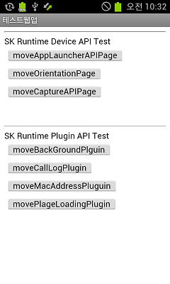

<!--
layout: 'post'
section: 'Cornerstone Framework'
title: 'Runtime 웹앱 개발'
outline: 'Runtime 웹앱 개발'
date: '2012-11-16'
tagstr: 'runtime'
subsection: 'Runtime for WebApp'
order: '[7, 2]'
-->

----------

# 2. Cornerstone Runtime 웹앱 개발

----------

## 2.1 Android Runtime 웹앱 개발 환경 

 - Authoring Tool을 이용하여 Android 용 웹앱 개발환경을 다운로드 받을 수 있다. 
 - [여기에 링크가 들어간다.](http://) 

### 2.1.1 Android Runtime 웹앱 개발 환경 구조 

1) src - plugin 개발시에 작성하는 Java Native Code

2) asset - 실제 웹앱의 웹 리소스(HTML/CSS/JS/IMG) 와 Runtime JavaScript Library 가 저장되는 위치 
	
-	**assets/www** : 웹앱의 저장 위치 
-	**assets/www/index.html** : 웹앱의 첫 실행 파일 

3) libs - Webview 를 이용하여 Device 의 단말 접근 기능을 제공하는 DeviceAPI가 포팅된 Android library 위치 

-	**Runtime.jar** : webview 및 DeviceAPI가 포팅된 JAVA library

4) drawable - device에 보여지는 icon 및 splash image를 저장하는 위치 

-	**icon.png** : device에 보여지는 icon
-	**splash.png** : 웹앱 실행 초기에 보여지는 splash image (optional) 

5) values , xml - 웹앱의 name 및 runtime setting을 할 수 있는 폴더 

-	**value/string.xml** : 웹앱의 name을 세팅하는 파일 
-	**xml/config.xml** : device의 orientation(portrait , landscape , audo) 및 splash image를 세팅 하는 파일 

6) AndroidManifest.xml : 하나의 Native Application으로써의 고유한 Package 명을 지정하는 파일, 하드웨어 가속 GPU 렌더링 사용여부를 지정하는 파일.

 

### 2.1.2 Android 웹앱 개발 절차

**step 1.**  Authoring tool을 이용해 Android Web App Template를 받으면 Lib 폴더에 **Runtime.jar가 기본으로 포함**되어 있다.

**step 2.**  웹앱 개발자는 assets 폴더 내부에 .html , .js , .css 와 같은 웹앱 소스 파일을 작성하여야 하며 시작 파일은 반드시 index.html 이어야 한다. **SRT-1.0.js는 웹앱 개발 환경 template의 기본 포함된 파일**이다. 

-	초기 페이지인 **index.html**을 생성한다. 

		<html>
		<head>
		
		</head>
		<body>
			Hello Runtime.
		</body>
		</html>
	
-	특정 웹페이지 내부에서 Runtime DeviceAPI를 사용하고 할 때에는 아래와 같이 JavaScript Library를 선언한다.
 
		

	> 웹앱에서의 단말의 해상도에 상관 없이 스크린에 fix되게 출력하는 방법

	- 모바일 웹에서는 Device에 따라 환경적인 차이가 많아서 고려해야 할 사항들이 몇 가지 있다. Web Page를 Device 해상도 별로 제작 할 수 있는 것도 아니고 어떤 Device가 접속했는지를 일일이 구분하여 서버상에서 Page를 내려줄 수 있는 것도 아니다. 이런 크로스브라우징 문제를 해결하기 위해서 Media query를 사용하기를 권장한다. 

	-	해상도가 다른 단말에 따라 화면에 fix하게 출력 하고 싶을 경우 아래와 같이 **Media Query**를 이용하여 device 해상도에 맞는 css를 적용하도록 한다. 

		>	Style.css example

			body {background-color:#000;}
			/* Galaxy Note 1 */ 
			@media screen and (max-width:801px) { #wrapper img{width:800px; height:1204px;}}
		
			/* Ipad2 */ 
			@media screen and (max-width:769px) { #wrapper img{width:769px; height:1204px;}}
		
			/* Galaxy S3 */
			@media screen and (max-width:721px) { #wrapper img{width:720px; height:1204px;}}
		
			/* Galaxy S2 */
			@media screen and (max-width:481px) { #wrapper img{width:480px; height:724px;}}

		> Index.html example

			<!DOCTYPE HTML>
			<html>
			<head>
			<meta http-equiv="Content-Type" content="text/html; charset=utf-8" />
			<meta name = "viewport" content = "user-scalable=no, width=device-width, target-densitydpi=device-dpi"/>
			
			<title>Media query test</title>
			<link href="style.css" rel="stylesheet" type="text/css" />
			
			</head>
			
			<body>
			 

				
			

			</body>
			</html>

**step 3.**  Res 폴더 내부에 웹앱 개발자가 사용하고자 하는 아이콘 이미지를 **icon.png**의 이름으로 삽입한다. 
		

**step 4.** **AndroidManifest.xml** 파일 내부의 package 명을 개발자가 변경을 해줘야 한다. 이는 고유한 값으로 Android 시스템 내부의 중복된 어플이 설치되지 않도록 한다. 

-	기본적인 Manifest 파일의 형식 

		<manifest xmlns:android="http://schemas.android.com/apk/res/android" android:windowSoftInputMode="adjustPan"
    	package="co.kr.skt.testapp.test" android:versionName="1.1" android:versionCode="5">

- GPU 하드웨어 가속 렌더링을 사용하고 싶다면 아래와 같이 application tag에 hardwareAccelerated 를 true로 설정 한다. 이는 웹 앱이 디바이스에서 사용하는 메모리 점유율을 늘어나지만 부드러운 2D image 렌더링을 가능하게 한다. (default는 생략됨) 

		<application android:icon="@drawable/icon" android:label="@string/app_name" android:hardwareAccelerated="true" android:debuggable="true">	

**step 5.** Application의 실제 단말기에서 보여지는 이름을 **string.xml의 app_name**에 정의한다.

-	string.xml

		<resources>
  		<string name="app_name">테스트웹앱</string> 
		</resources>

**step 6.** **res/xml/config.xml** 의 orientation , splashscreen , screen mode preference를 이용하여 웹앱의 방향(가로/세로)과 splash image(html 이 로딩 되기 전에 보여지는 image)와 마지막으로 Screen Mode(네비게이터 바, 타이틀바 사용여부)를 세팅 할 수 있다. 이는 선택 사항으로 웹앱 개발자가 작성하지 않으면 default 값을 따르게 된다. 

	1) 웹앱의 방향(default 는 auto)

		- 가로 방향
		<preference name="orientation" value="landscape"/>

		- 세로 방향
		<preference name="orientation" value="portrait"/>

		- 자동 	
		<preference name="orientation" value="auto"/>

	2) splash image(default 는 splash image를 사용하 않음) 

		- value값인 splashskt.png가 res/drawable 폴더 내부에 존재 하여야 한다.
		> image area
		<preference name="splashscreen" value="splashskt"/>

	3) screen Mode(default는 네비게이터 바와 타이틀 바가 모두 보임)

		- 네비게이터 바와 타이틀 바가 모두 보임 
		<preference name="screenmode" value="default"/>

		- 네비게이터 바만 보임 , 타이틀 바는 안보임
 		<preference name="screenmode" value="maximized"/>

		- 네비게이터 바와 타이틀 바가 모두 안보임
		<preference name="screenmode" value="fullscreen"/>
		

**step 7.** Eclipse의 빌드 아이콘을 이용하여 Android App을 빌드하여 Device에 정상적으로 설치됨을 확인한다. 

**step 8.** Device에 WebApplication이 정상적으로 출력됨을 확인한다. 

----------

## 2.2 iOS Runtime 웹앱 개발 환경

 - Authoring Tool을 이용하여 iOS 용 웹앱 개발환경을 다운로드 받을 수 있다. 
 - [여기에 링크가 들어간다.](http://) 
 - iOS용 웹앱 개발환경은 Xcode 버전 4.3, Mac OSX 버전 10.7.4 Lion 기준으로 개발되었으며 iOS 버전은 5.0 이다.

### 2.2.1 iOS Runtime 웹앱 개발 환경 구조  

1) SRT.framework - Cornerstone Runtime Library

2) www - 실제 웹앱의 웹 리소스(HTML/CSS/JS/IMG) 와 Cornerstone Runtime JavaScript Library 가 저장되는 위치 

-	**www** : 웹앱의 저장 위치 
-	**www/index.html** : 웹앱의 첫 실행 파일
-	**www/SRT-1.0.js** : Cornerstone Runtime JavaScript Library

3) SRT_Template/Resources - 어플에 필요한 리소스를 저장하는 위치

-	**icons** : Icon을 위한 이미지 폴더
-	**splash** : splash screen을 위한 이미지 폴더

4) SRT_Template/Supporting Files - 앱 및 런타임 설정 파일이 위치하는 폴더

-	**SRT_Template-Info.plist** : iOS 앱을 위한 설정 파일
-	**SRT.plist** : Cornerstone Runtime을 위한 설정 파일

 

### 2.2.2 iOS 웹앱 개발 방법

**step 1.**  Authoring tool을 이용해 iOS Web App Template를 받아서 Xcode로 프로젝트(파일명 : SRT_Template.xcodeproj)를 연다. 

**step 2.**  Web App 개발자는 www 폴더 내부에 .html , .js , .css 와 같은 webapp을 작성하여야 하며 시작 파일은 반드시 index.html 이어야 한다. **SRT-1.0.js는 template 기본 파일**이다. 

-	특정 웹페이지 내부에서 Runtime에서 제공하는 DeviceAPI를 사용하고 할 때에는 아래와 같이 JavaScript Library를 선언한다.
 
	``

**step 3.**  Resources/icons 폴더 내부에 웹앱 개발자가 사용하고자 하는 아이콘 이미지를 프로젝트에 추가한다. 기본으로 설정된 icon 파일 이름은 **icon**이며 기본 설정일 경우 단말에 따라 적용되는 icon 파일 이름은 아래와 같다. icon 파일 이름 설정 방법은 step 5. 에서 다룬다.

- **icon.png** : Iphone 3GS 이전 모델 용 아이콘 이미지
- **icon@2x.png** : iphone 4/4s 용 아이콘 이미지
- **icon-72.png** : ipad / ipad2 용 아이콘 이미지
- **icon-72@2x.png** : new ipad 용 아이콘 이미지

**step 4.** Resources/splash 폴더 내부에 웹앱 개발자가 사용하고자 하는 스플래쉬 이미지를 추가한다.  기본으로 설정된 splash 파일 이름은 **Splash**이며 기본 설정일 경우 단말에 따라 적용되는 splash 파일 이름은 아래와 같다. splash 파일 이름 설정 방법은 step 6.에서 다룬다 

참고로 스플래쉬 이미지란 웹앱 실행시 웹앱이 로딩될때까지 보여지는 이미지 화면을 뜻한다.

- **Splash.png** : Iphone 3GS 이전 모델용 스플래쉬 이미지
- **Splash @2x.png** : iphone 4/4s 용 스플래쉬 이미지
- **Splash-Landscape.png** : ipad / ipad2 용 가로 스플래쉬 이미지
- **Splash-Portrait.png** : ipad / ipad2 용 세로 스플래쉬 이미지
- **Splash-Landscape@2x.png** : new ipad 용 가로 스플래쉬 이미지
- **Splash-Portrait@2x.png** : new ipad 용 세로 스플래쉬 이미지

**step 5.** Supporting Files/SRT_Template-Info.plist 파일을 수정하여 어플의 여러 속성 설정이 가능하다. 이는 Cornerstone Runtime 프로젝트 뿐만이 아니라 iOS 어플 공통 적용사항이다. 아래는 주요 설정 값들이다.

- **Bundle display name** : 어플명
- **Icon files / Icon files(iOS5)** : 아이콘 이미지 파일 이름명
- **Bundle identifier** : 어플 고유 ID. 실제 단말 연동을 위해서는 애플사에 개발자 인증(provisioning profile)을 받아야하며 그때 설정한 ID를 넣는다.
- **Supported interface orientations / Supported interface orientations(ipad)** : 해당 어플이 지원하는 화면 회전 허용값. 예를 들어 Portrait(bottom home button)만이 설정되어 있다면 iPAD에서 회전을 하여도 실제로 화면이 회전되지 않는다.

**step 6.** Supporting Files/SRT.plist 파일을 수정하여 Cornerstone Runtime의 여러 속성 설정이 가능하다. 

- **UIWebViewBounce** : 화면 드래그를 끝까지 했을 경우 웹뷰가 바운스 효과를 내는지 여부를 설정함.
- **EnableLocation** : 해당 어플이 Geolocation 을 설정할수 있는지 여부를 설정
- **EnableViewportscale** : 뷰포트 확대/축소 허용 여부를 설정
- **AutoHideSplashScreem** : Yes일 경우 DeviceReady가 되면 자동으로 스플래쉬 스크린이 해제된다. No일 경우 API를 통해서 원하는 시점에 해제가 가능하다
- **SplashImage** : 스플래쉬 스크린을 위한 이미지 파일명 설정. 기본은 "Splash"로 설정되어 있다.
- **Plugins** : Cornerstone Runtime JS 라이브러리와 Native Class간의 연동을 위한 Map이다.
Key의 경우 JS 라이브러리를 위한 모듈명이며 Value의 경우 NativeClass 모듈명이다.
3rd 파티 개발자가 추가 플러그인을 개발할 경우에 사용한다.
- **InstalledApplications** : AppLauncher 모듈의 getInstalledApplications API 사용시 검색 가능한 어플리스트. 개발자가 어플리스트를 설정하면 getInstalledApplications API를 통해 어플 리스트중 실제 단말에 설치된 어플의 리스트를 가져올 수 있다. 어플리스트는 불려지는 어플에 설정된 URL Schemes에 설정된 값으로 리스트를 설정한다. 기본 설정은 기본 탑재 어플인 music, sms, mailto, videos 4가지가 설정되어 있다. 

**step 7.** Run을 눌러서 실제 단말에서 웹앱이 정상적으로 실행되는지 확인한다. 

