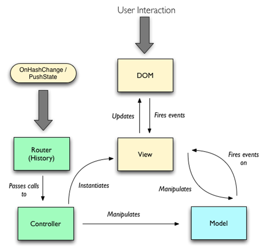

<!--
{
	"id": "f4",
	"title": "MVC",
	"group": 1,
	"order": 11
}
-->

-----------------------

# MVC의 기본 패턴 익히기  #

-----------------------

**- Model, View, Controller로 분리**  
**- Model : 애플리케이션의 데이터 관리**  
**- View : Model을 표현하고 사용자의 입력 수신**  
**- Controller(Router) : 페이지 전환 감지**

