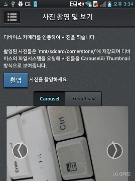
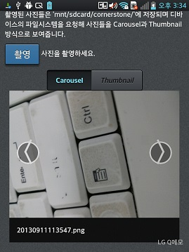
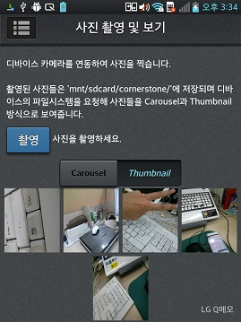

<!--
{
	"title": "사진 촬영 및 보기",
	"group": 2,
	"order": 19
}
-->

-----------------------

# 사진 촬영 및 보기 #

-----------------------

- 디바이스 카메라를 연동하여 사진을 촬영.
- 촬영된 사진들은 디바이스의 폴더에 저장되며 파일 시스템을 요청해 사진들을 Carousel과 Thumbnail 방식으로 보여줌.

