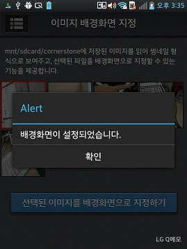

<!--
{
	"title": "이미지 배경화면 지정",
	"group": 2,
	"order": 22
}
-->

-----------------------

# 이미지 배경화면 지정 #

-----------------------

- 지정된 폴더에 저장된 이미지를 읽어 썸네일 형식으로 보여줌.
- 선택된 파일을 배경화면으로 지정할 수 있는 기능 제공.

