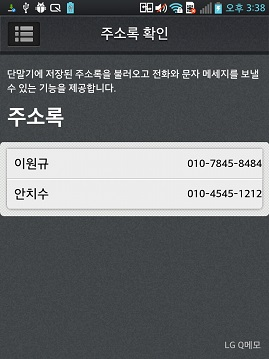
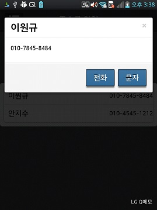

<!--
{
	"title": "주소록 확인 및 전화 걸기, 메세지 보내기",
	"group": 2,
	"order": 31
}
-->

-----------------------

# 주소록 확인 및 전화 걸기, 메세지 보내기 #

-----------------------

- 단말기에 저장된 주소록을 불러오고 전화와 문자 메세지를 보낼 수 있는 기능을 제공.

