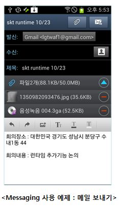

<!--
{
	"title": "Cornerstone Runtime 소개 – 기능 : HTML5 Device APIs",
	"group": 2,
	"order": 5
}
-->

-----------------------

## Cornerstone Runtime 소개 – 기능 : HTML5 Device APIs ##

-----------------------

 - Cornerstone Runtime은 모바일 브라우저에서 지원하지 못하는 HTML5 기능을 지원
 	- Cornerstone Runtime은 아래와 같은 W3C HTML5 Device APIs 규격을 준수

<table class="table table-bordered">
	<tr>
		<th class="fixed_table">카테고리</th>
		<th class="fixed_table">상세기능</th>
	</tr>
	<tr>
		<td class="fixed_table">Accelerometer </td>
		<td class="fixed_table">가속도 정보를 얻는 기능</td>
	</tr>
	<tr>
		<td class="fixed_table">Orientation </td>
		<td class="fixed_table">방향 정보를 얻는 기능</td>
	</tr>
	<tr>
		<td class="fixed_table">Vibration </td>
		<td class="fixed_table">디바이스의 진동을 실행하는 기능</td>
	</tr>
	<tr>
		<td class="fixed_table">Battery Status</td>
		<td class="fixed_table">현재 배터리 잔량 및 충전 유무 을 얻는 기능</td>
	</tr>
	<tr>
		<td class="fixed_table">Network Information</td>
		<td class="fixed_table">네트워크 연결 type을 얻는 기능 </td>
	</tr>
	<tr>
		<td class="fixed_table">Messaging</td>
		<td class="fixed_table">SMS, MMS, Email을 송신하는 기능</td>
	</tr>
	<tr>
		<td class="fixed_table">Sensor</td>
		<td class="fixed_table">빛,거리 센서의 값을 얻는 기능</td>
	</tr>
	<tr>
		<td class="fixed_table">Contact</td>
		<td class="fixed_table">연락처 정보를 삽입,삭제,조회하는 기능 </td>
	</tr>
	<tr>
		<td class="fixed_table">Calendar</td>
		<td class="fixed_table">일정 정보를 삽입,삭제,조회하는 기능</td>
	</tr>
	<tr>
		<td class="fixed_table">File</td>
		<td class="fixed_table">File I/O를 하는 기능</td>
	</tr>
	<tr>
		<td class="fixed_table">Indexed DB</td>
		<td class="fixed_table">Index 기반 DB를 지원하는 기능</td>
	</tr>
	<tr>
		<td class="fixed_table">Push</td>
		<td class="fixed_table">Android/iOS의 Push를 지원하는 기능</td>
	</tr>
</table>

