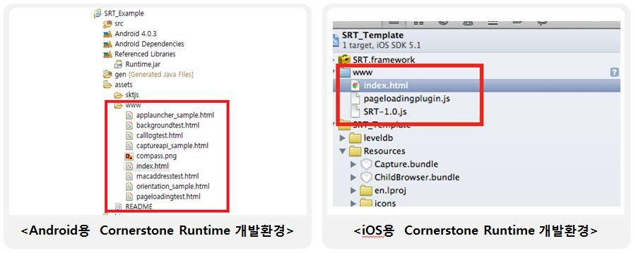

<!--
{
	"title": "Cornerstone Runtime 소개 – 간편한 모바일 웹 앱 템플릿 제공",
	"group": 2,
	"order": 7
}
-->

-----------------------

## Cornerstone Runtime 소개 – 기능 : 간편한 모바일 웹 앱 템플릿 제공 ##

-----------------------

 - Cornerstone Runtime이 제공하는 Android /iOS 웹 앱 개발 환경 프로젝트에 웹 소스를 포함하는 것만으로 웹 앱 개발 가능

 - 단순 텍스트 수정으로 이름 /아이콘 /화면회전 지원과 같은 모바일 앱 설정 가능

