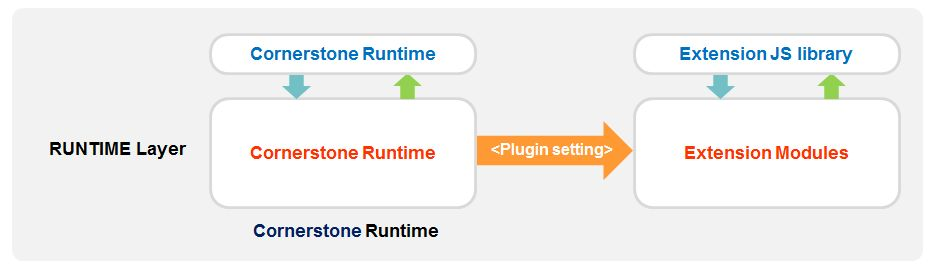

<!--
{
	"title": "Cornerstone Runtime 소개 – 손쉬운 확장 구조",
	"group": 2,
	"order": 9
}
-->

-----------------------

## Cornerstone Runtime 소개 – 기능 : 손쉬운 확장 구조 ##

-----------------------

 - Runtime 기능을 확장하는 개발자는 Runtime을 수정 할 필요가 없음

 - Runtime의 내부의 구조를 알지 못해도 Runtime API의 확장 개발이 가능

	- 개발자는 가이드 문서를 따라 확장 JS library와 확장 native module 을 개발
	- 모바일 웹 앱에서 확장 API를 이용하여 추가 기능 사용 가능 

