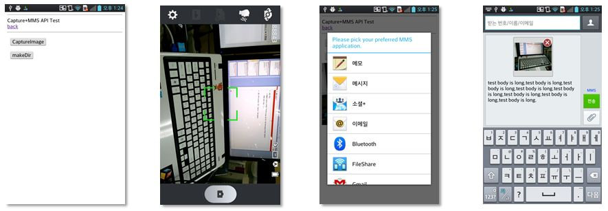

<!--
{
	"title": "개발 실습 1. ",
	"group": 2,
	"order": 12
}
-->

-----------------------

## 개발 실습 1.  ##

-----------------------

 - 실습 목표 :
 
	- 템플릿 Capture API를 이용하여 Image 를 찍고 이를 Messaging API를 이용하여 MMS 첨부 파일로 전송

	- 필수 API module : File , Capture , Messaging 

 

