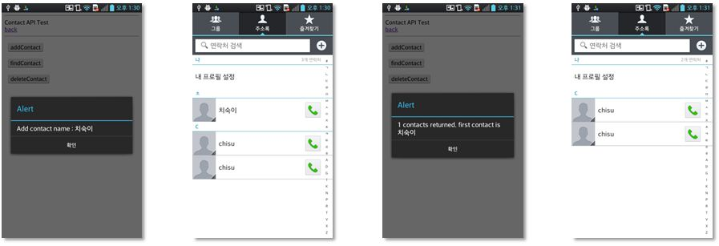

<!--
{
	"title": "개발 실습 2. ",
	"group": 2,
	"order": 13
}
-->

-----------------------

## 개발 실습 2.  ##

-----------------------

 - 실습 목표 :
 
	- 템플릿 Contact API를 이용하여 Device 에 특정 Contact를 Add 및 Delete 하는 실습 

	- 필수 API module : Contact 

 

