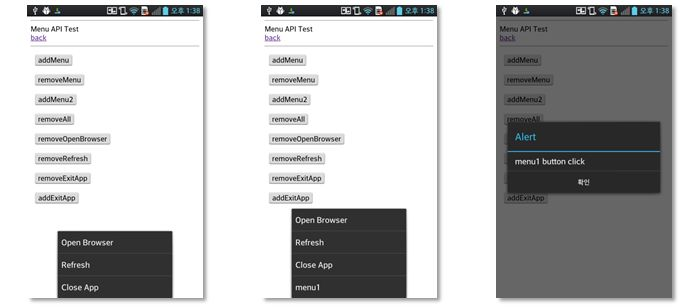

<!--
{
	"title": "개발 실습 3. ",
	"group": 2,
	"order": 14
}
-->

-----------------------

## 개발 실습 3.  ##

-----------------------

 - 실습 목표 :
 
	- 사용자 정의 menu를 추가하고 menu를 클릭하였을 때 alert창을 띄우는 실습

	- 필수 API module : MenuManager 

 

