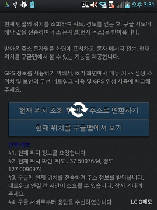

<!--
{
	"title": "현재 위치 주소 조회",
	"group": 2,
	"order": 17
}
-->

-----------------------

# 현재 위치 주소 조회 #

-----------------------

- 현재 단말의 위치를 조회하여 위도, 경도를 얻은 후 구글 지도에 해당 값을 전송하여 주소 문자열(번지 주소)을 받아옴.
- 받아온 주소 문자열을 화면에 표시하고 현재 위치를 구글맵에서 볼 수 있는 기능을 제공함.
- GPS 정보를 사용하기 위해서는 초기 화면에서 메뉴 키 -> 설정 -> 위치 및 보안의 무선 네트워크 사용 및 GPS 위성 사용에 체크해야함.

